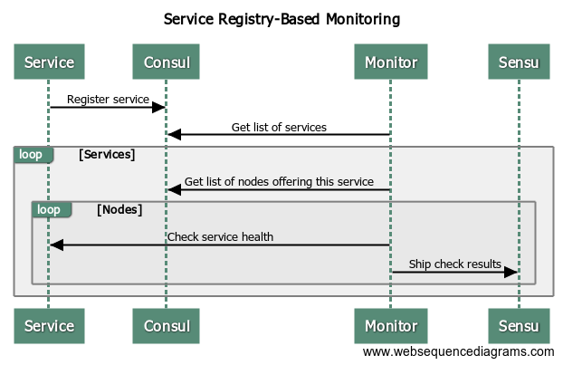
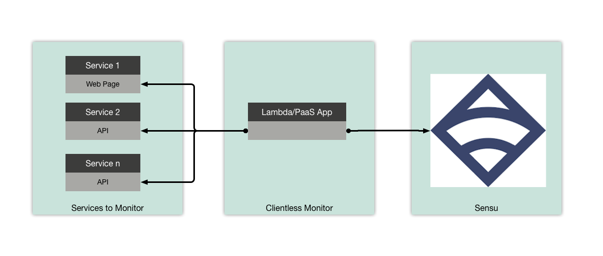
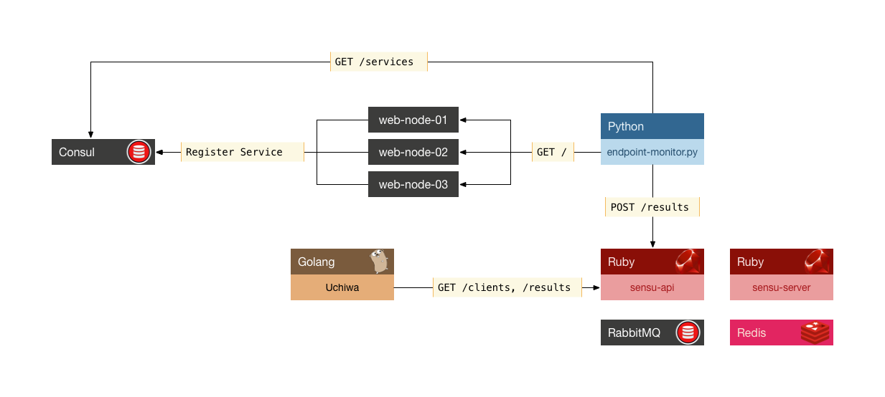

# Disclaimer

This repo is provided for educational purposes only. This will not be maintained going forward nor is there any support for the code herein, neither by myself nor my employer, T-Mobile.

# Look, ma! No clients!

Typically, we monitor stuff in Sensu using the `sensu-client` process. Stand up a new server, deploy the client, drop in some config and plugins - hopefully all with `${your_fav_config_management_solution}` - then call it a day.

But, sometimes you can't (prefer not to, etc) deploy a client. That can be true in instances such as:

* Appliance servers (or any server that you don't have permissions to deploy on because, bureaucracy)
* Networking gear
* SaaS applications
* PaaS-based applications
* Wanting to avoid the overhead of deploying a sidecar for each container

Monitoring stuff without a client is admittedly not a typical deployment scenario, so this repo contains a `docker-compose` based setup to help illustrate the concept, while attempting to still be somewhat real-world.

You will see that even without clients, we can efficiently monitor a group of HTTP endpoints in a manner that enables owners of those endpoints to not only have their stuff monitored, but also control aspects of *how* it is monitored (e.g.: specify handlers), all in a self-service model.

# Solution Overview

Let's walk through the main components present in this repo:

1. [`docker-compose`](https://docs.docker.com/compose/) is used to coordinate start, stop, and destruction of the containers that comprise the demo
2. Of course, [Sensu](https://sensu.io/) Server and API are here, along with [Uchiwa](https://uchiwa.io/) so we can see the end result
3. [Consul](https://www.consul.io/) is here to do it's typical jam: Provide a service registry, which...
4. A custom Python script will use to:
    1. Get a list of all services currently in Consul
    2. Iterate that list to get all of the nodes for each service
    3. For each node, perform a simple HTTP check to ensure the endpoint is reachable
    4. Phone home the check result to Sensu's `/results` API
    5. Perform cleanup to remove any clients in Sensu that are no longer present in Consul

The flow looks like this:

High-level architecture:

Containers and communications:

# Enough Talk... I Wanna See It!

You can get a quick demo of the capabilities by running the `./run_demo.sh` script in the root of this repo.

You will see how our monitoring script uses Consul to discover the endpoints, adds/removes them as clients to Sensu as appropriate, and invokes a simple HTTP check on the endpoints.

# Diving Deeper

The Sensu and Consul bits are 100% vanilla (by design), so there is not much interesting to see there if you've used them before. The real interesting bits are in the Python script that does the monitoring, client addition/deletion, etc.

I've made an effort to (over)comment the code to ensure it's as self-explanarory as possible. Feel free to check it out: `./endopoint-monitor/endopoint-monitor.py`.
